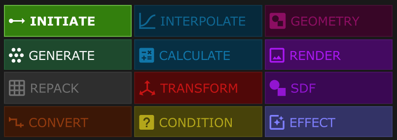

# PiNODEs

📰 *Documentation updated on March 01, 2024*

💾 PiNODEs v.65 * version updated on March 01, 2024*

---

## 🧰 Introduction

PiNODEs is a collection of GLSL-based components for handling parametric design workflows inside TouchDesigner, and is one of the key features of the PiKit toolkit, which is still under development.

The primary goal of developing these nodes was to enable point-based processing using TOPs. While the upcoming release of POPs will provide a more efficient and comprehensive solution for this, these nodes will be refactored accordingly and may still provide an ideal workflow for certain parametric drawings within TouchDesigner.

⚠️ Currently, these nodes are designed for 2D drawing, which limits their functionality in 3D space.

---

## 📚 Node Categories

There are multiple categories of nodes, each responsible for certain processes. 

| INITIATE | Generating raw floats and vectors | Generator |
| --- | --- | --- |
| GENERATE | Generating shape points | Generator |
| REPACK | Repacking input data to new dimensions | Filter |
| CONVERT | Converting input data to new pixel formats | Filter |
| INTERPOLATE | Remapping input values to a new range | Filter |
| CALCULATE | Applies mathematical functions onto input data | Filter |
| TRANSFORM | Applies transformations onto the input data | Filter |
| CONDITION | Outputs 0 or 1 for each data point based on a specified conditional state. | Filter |
| GEOMETRY | Generates Geometry based on input points. The output is a DAT pointing to the geometryCOMP which should be fed to a Renderer. | Exporter |
| RENDER | Renders the input geometry address. The input is in DAT format. | Exporter |
| SDF | Renders input points using SDF algorithms. | Exporter |
| EFFECT | Applies certain effects on input image/TOP. | Exporter |

---

## 🎲 Data Depth

Each PiNODE has certain inputs and outputs coded with certain colors, indicating their data depth aka pixel format. 
In PiNODEs terminology, these data types are divided into following formats:

| Depth | Description | Data Type | Example | Pixel Format in TD |
| --- | --- | --- | --- | --- |
|  0D  | Zero-dimension | Boolean | 0 or 1 | 8-bit Mono |
|  1D  | One-dimension | Float | 0.1, 2.5, -100.33 | 32-bit Mono |
|  2D  | Two-dimension | Vector 2 | [0.1, -0.33] | 32-bit RG |
| -i suffix | i.e. 1Di, 2Di, … | Integer | 0, 2, 5, -10 | - |
|  3D  | Three-dimension | Vector 3 | [0.33, 0.1, 0] | 32-bit RGB |
|  4D  | Four-dimension | Vector 4 | [0.2, 0.2, 0.2, 1] | 32-bit RGBA |
|  nD  | Any-dimension | * | * | * |
| IMG TOP | Images or TOPs | RGBA Color | - | 8-bit RGBA |
|  CHOP  | CHOPs | Channel Operators | - | - |
|  DAT  | DATs | Data tables | - | - |

 
---

## 🧵 Wiring Nodes

Each PiNODE component has a viewer that eases the process of wiring inputs and outputs. 

In PiNODEs terminology, the UI provided for inputs and outputs are called `Port`. 

✅To wire the two ports (inputs and outputs) of separate nodes:

1. Select the nodes and enable their `viewer active` option.
2. Click on the first port. This port will start blinking meaning that it’s ready to be connected to the next port.
3. Click on the next port to finish the wiring.

❌To disconnect a wire from port, hold down the `Alt` key and left click on the port. 

➕There is an alternative way to add nodes while making wire connection:

1. Rightclick on a port
2. From the floating menu on port, choose `Node`
3. Locate and select the PiNode you wish to connect the port to.

   
---

## 🚧 Development

### 🪲 Bug Report

Just like any program, this one comes with bugs and errors as well.

This is the list of the bugs that are already founded and under debugging process.

[Bugs List](https://www.notion.so/1a9c2176e105817a90bec7b41fb2ec04?pvs=21)

🔍 If you found a new bug, there are multiple ways to report:

- [Report it on our discord #bug-report channel](https://discord.gg/tS657scR)
- [Post an issue on Github](https://github.com/pitheorem/PiNodes/issues)
- [Write me an email](mailto:pitheorem@gmail.com)

### 🚆 Wishlist

Got a cool idea? Feel free to share it on our [discord](https://discord.gg/tS657scR) or [drop me an email.](mailto:pitheorem@gmail.com)

### 🫂 Community

We have a discord server so we can better connect and share things within the community. So feel free to join us [here](https://discord.gg/tS657scR).
